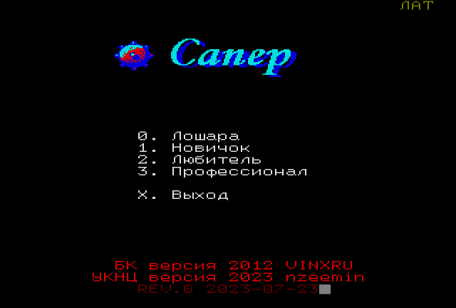
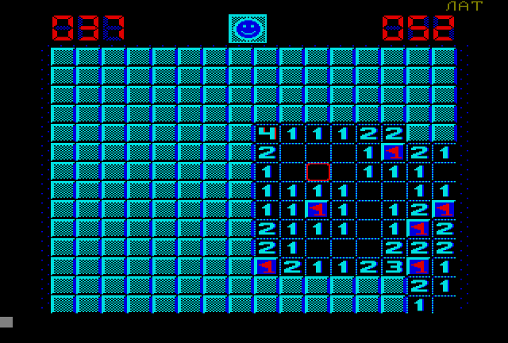
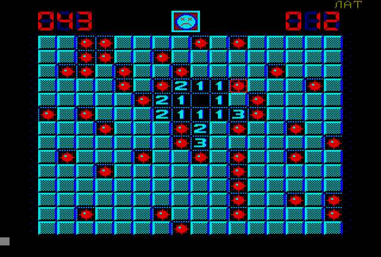

# uknc-miner Игра "Сапёр" для УКНЦ

Взял исходник MINER для БК от Алексея Морозова, его же спрайты и переписал "по мотивам" для УКНЦ и для классического MACRO.

Оригинал можно посмотреть тут: https://r-games.net/bk001x/games/31554-saper.html

Исходник оригинала тут: https://github.com/ysei/Game_BK0010_Miner_on_asm

  

Управление:
<kbd>X</kbd> выход в меню, любая клавиша кроме пробела это флаг и знак вопроса, пробел - раскрыть клетку.

